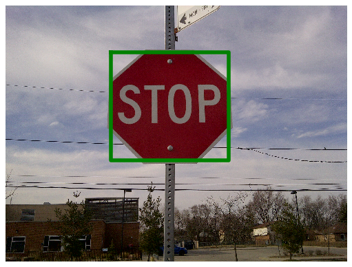
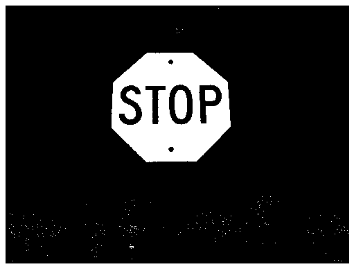
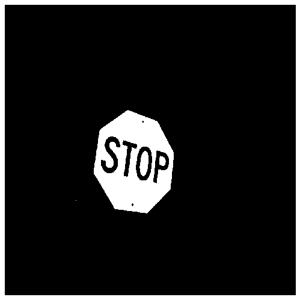
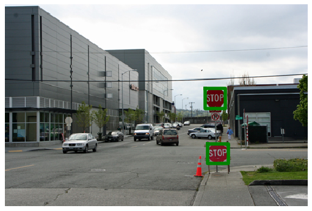
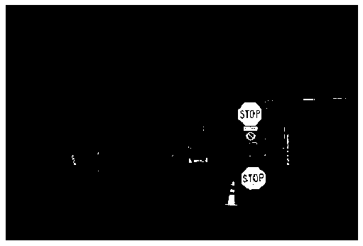
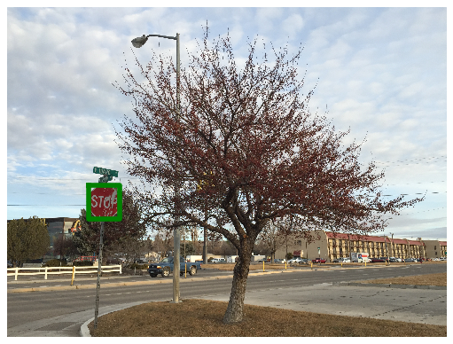
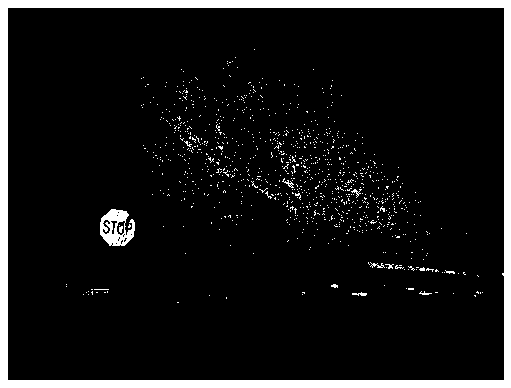

# Color Segmentation and Stop Sign Detection
This is the project 1 of the course UCSD ECE276A: Sensing & Estimation in Robotics.

Traffic sign detection is an essential part of autonomous driving, which has been researched for a few decades. Much research has been conducted with a front camera installed in front of the vehicle sensing the environment in real-time. The goal of traffic sign detection is to design a visual model to localize and classify traffic signs in an image. It requires the ability to robustly model invariance to brightness, occlusions, and other variations in the environment.

In this project, we design an algorithm for stop sign detection. We propose an algorithm based on image segmentation with pixel color classifier and deterministic bounding box classifier with object shape detection. With the assistant of the N-way merge approach, this algorithm can detect stop signs in various environmental conditions, invariant to changes in brightness and color saturation. We also test the performance of various supervised learning algorithms on classifying pixel in different colors.

## Project Report

* [Chun-Nien Chan. "Supervised Learning for Color Segmentation and Stop Sign Detection." 01 Feb. 2020. ECE 276A, UCSD, student paper](report/color_segmentation_and_stop_sign_detection.pdf)

## Screenshots

Stop sign detection | Color segmentation
--------------------|---------------------
|
|
|
|

## Implementations:
Source files:
- src/classifier.py: Classes for classification purpose. The classifiers are:
    - MLClassifier: a basic class for all machine learning classifier. Classes inherit it must implement two functions: fit(X, y) and predict(X). fit(X, y) is used to train the model and predict(X) for testing. The design of APIs are same as sklearn estimator.
    - SimpleHSVRedClassifier: a deterministic classifier. Simply classify pixel color by checking if values of channel H, S, V lies in a certain range.
    - LogisticRegression: logistic regression MLClassifier
    - OneVsAllLogisticRegression: one-vs-all MLClassifier
    - KaryLogisticRegression: K-ary logistic regression MLClassifier
    - GaussianNaiveBayes: Gaussian naive Bayes MLClassifier
    - SSBBoxDeterministic: bounding box classifier which implemented the stop sign detection algorithm in the report.

- src/detector.py: Classes for detecting properties of an image. Most of them are wrappers for opencv and skimage functions.
    - Region: find bounding boxes from labeled regions. Wrapper of skimage.measure.regionprops
    - Contour: find contours from an image. Wrapper of cv2.findContours
    - Polygon: approximated edges, corner angles, and shape of polygon given a curve. Wrapper of cv2.approxPolyDP

- src/image.py: Class for image loading and processing
    - Image: A wrapper of image numpy array. It is used to easily convert color space, perform histogram equalization, and color enhancement. A wrapper of several cv2 function related to image loading and processing

- src/stop_sign_detector.py: The entry file for the stop sign detector
    - StopSignDetector: The entry class of color segmentation and stop sign detection.

- tools/labeltool.py: Data labeling tool. You can run this tool with command "python labeltool.py -i \<file>".

Notebooks:
- pixel-learning-<feature>-<number_of_classes>.ipynb: experiments for supervised learning algorithms performance on different training data.
- pixel-learning.ipynb: for generating machine learning models for testing data and submission.
- experiment-detection.ipynb: visualize segmentation and detection result. For generating detection and segmentation results for testing data.

## References
* [UCSD ECE276A: Sensing & Estimation in Robotics](https://natanaso.github.io/ece276a/)
